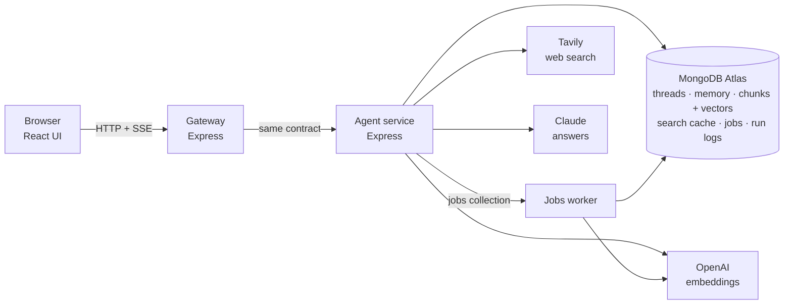

# Cited — AI Research Assistant

**Ask a question, get a streamed answer where every claim links to its source.** Cited
searches the live web and your own uploaded documents, reads the pages instead of skimming
snippets, and cites down to the page. Ask a harder question and switch to **Deep**: it plans
sub-questions, researches them in parallel, and merges everything into one numbered set of
citations.

It is a Perplexity-style answer engine built as a production-minded agent service: bounded
tool loops, a spend gate on the expensive mode, honest failure handling, async document
ingestion, and a log of every run.

## What it does

| | |
|---|---|
| **Quick answers** | One web search, the 2–3 best pages actually fetched and read, a short cited answer streamed token by token. Sources arrive before the first word, so citation chips render as the text streams. |
| **Deep research** | A planner splits the question into 3–6 sub-questions (streamed before any retrieval), each is researched in parallel, and the results merge into one contiguous citation numbering. A structured answer follows: the direct answer, a section per sub-question, and what is still unclear. Capped per user per day. |
| **Your documents** | Upload PDFs, Markdown or text to a *Space*. Ingestion runs on a background worker; questions are answered with hybrid search (vector + BM25, fused with reciprocal rank fusion) and cited as `file.pdf, p. 3`. |
| **Auto routing** | With a Space selected, the agent checks your documents first and only goes to the web for what they don't cover, so one answer can cite both. |
| **Memory** | "Remember I prefer metric units" is saved, applied in every later thread, and visible and deletable in the UI. Nothing is remembered that you can't see. |
| **Conversation** | Follow-ups see the thread ("how does *it* compare to WebSockets?"). |
| **Transparency** | Every step the agent takes is streamed as a trace event with its reason, so you can see why an answer cites what it cites. |

## Architecture



- **Gateway**: the only thing the browser can reach. Identity header, request validation
  against shared zod schemas, a per-user rate limit on the routes that cost money, a request
  id that follows one request through both services' logs, and unbuffered stream pass-through.
  It holds no keys.
- **Agent service**: the agent loop and its tools, quick and deep search, memory, retrieval,
  and the deep-search spend gate. The only process with provider keys.
- **Jobs worker**: a separate process that turns uploads into searchable chunks, so parsing a
  60-page PDF never competes with a streaming answer.
- **MongoDB Atlas**: one database for everything, vectors included, so a citation is one
  document and a Space is a plain filter.

Design decisions, failure handling and trade-offs are in **[ARCHITECTURE.md](ARCHITECTURE.md)**.

## Engineering highlights

- **Limits enforced by code, not by prompts.** Tool-call and wall-clock caps per mode; a run
  that hits one reports `terminated: "cap"` instead of pretending it finished. A quick search
  is never even offered the deep planner, and spent search budget is enforced by withdrawing
  the tool.
- **Fail loud.** A provider error ends the run with a `502` and an error event, never a
  plausible-looking answer. Failed tool calls are visible in the trace with their error.
- **Grounded citations.** Every `[n]` resolves to something retrieved in that request, and
  each citation's snippet is verbatim text from the fetched page or document chunk.
- **Read-your-write indexing.** A document only becomes `indexed` after a probe query finds
  its chunks in both search indexes; Atlas Search is eventually consistent, and "stored" is
  not "searchable". The worker claims jobs atomically, retries failures, sweeps crashed jobs,
  and on retry reuses stored embeddings instead of paying for them twice.
- **Cost-aware quick path.** The first search is the user's question verbatim (so repeats
  hit the two-tier search cache deterministically), the model picks pages in a single turn,
  and the answer step reads the best-matching passages of each page, not the whole page.
- **An atomic spend gate.** The daily deep-search allowance is one conditional update in
  MongoDB, so simultaneous requests can't both take the last slot.
- **Observability.** Structured JSON logs in both services correlated by request id, a run
  log per answer (tools called, tokens, cost, wall clock, termination), and `/stats`
  computed from those same records.

## Measured results

Hand-run measurements against the local stack with **Claude Haiku 4.5**, Tavily search
priced at $0.008 per uncached call, and MongoDB Atlas M0. Small samples; the full benchmark
in `benchmark/` has not yet been run end to end.

| | Result |
|---|---|
| Retrieval recall@5, 39-question gold set over the test corpus | **39 / 39** |
| Citation grounding, re-fetching every cited page | **12 / 12** verifiable citations |
| Quick answer cost, repeated question (search cached) | **$0.003 – $0.006** |
| Quick answer cost, new question | **$0.011 – $0.016** (the search itself is $0.008) |
| Quick answer, total time | **3 – 11 s** |
| Answer from your documents | **$0.002 – $0.005**, about 2–3 s |
| Deep research cost | **$0.05 – $0.07** per answer, 18–22 tool calls, 22–31 s |
| Deep vs quick, distinct sources read for the same question | **3.3 – 3.7×** |
| Upload accepted (`202`, file stored, job queued) | **~275 ms** |

Not there yet: **time to first token** on quick web answers is 2.6–8.3 s against a 2.5 s
target. See [Known limitations](#known-limitations).

## Running it locally

**You need:** Node 20.19+, a MongoDB Atlas cluster (the free M0 tier works), and API keys for
Anthropic (answers), OpenAI (embeddings only) and Tavily (search; the free tier is enough).

```bash
npm install
cp .env.example .env            # fill in MONGODB_URI and the three API keys
npm run indexes                 # creates the regular, TTL, vector and text indexes
npm run dev                     # agent :8000, worker, gateway :8787, UI :5173
```

Open http://localhost:5173. Search indexes build asynchronously; check them with
`node scripts/create-indexes.mjs --status`.

Everything tunable lives in `.env`: the model (`LLM_MODEL`), search provider
(`SEARCH_PROVIDER=tavily|serpapi`), per-mode caps, the deep-search daily cap, chunking, and
retrieval settings (top-k, candidates per retriever, RRF constant, the auto-routing
threshold).

> **No Atlas?** `docker compose up mongo` runs a plain MongoDB without Atlas Search. Set
> `VECTOR_BACKEND=mongo-cosine-scan` and retrieval falls back to scoring in Node; `/health`
> reports which backend is live.

## API

| Route | |
|---|---|
| `POST /threads/{id}/ask` | Streams `trace → sources → token → done` (deep: `plan` first). Body: `query`, `mode` (`auto`/`web`/`docs`), `depth` (`quick`/`deep`), `spaceId` |
| `POST /threads` · `GET /threads` · `GET /threads/{id}` | Conversations |
| `GET /memory` · `DELETE /memory/{id}` | Long-term memory |
| `POST /spaces` · `GET /spaces` | Document collections |
| `POST /spaces/{id}/documents` · `GET /spaces/{id}/documents` | Upload (`202`) and indexing status |
| `GET /stats` · `GET /health` | Usage and cost, and what's live (model, search provider, vector backend, database) |

Every route but `/health` requires an `X-User-Id` header. Errors use one shape across both
services: `400` invalid input, `401` missing user, `404` unknown id, `413` file too large,
`429` rate limit or daily deep cap (with `resetsAt`), `502` upstream failure. The full
contract is executable zod schemas in [`packages/contract/`](packages/contract/src).

## Evaluation

`node benchmark/bench.mjs` runs the whole system through the gateway against declared targets
in [`benchmark/sla.json`](benchmark/sla.json): latency percentiles per mode, citation
grounding (every cited snippet re-checked against the live page), recall@5 on the gold set,
search-cache hit rate on a half-repeated workload, document ingest decoupling, deep-vs-quick
source ratio, the deep-search cap, memory across threads, and cost per answer. It exits
non-zero on any missed target. `--smoke` runs a five-question sanity check.

## Project structure

```
backend/agent/      agent service: loop.ts (quick), deep.ts (deep), retrieve.ts (hybrid search),
                    memory.ts, ingest.ts + worker.ts (document pipeline), deepCap.ts (spend gate)
backend/gateway/    the edge: validation, rate limit, proxy and SSE pass-through
packages/contract/  shared zod schemas and types for every route, event and document
web/                React UI
benchmark/          benchmark, SLA targets, test corpus and gold question set
scripts/            index setup, run-log export
```

## Known limitations

- **Time to first token** on quick web answers (2.6–8.3 s) misses the 2.5 s target. The
  remaining time is one model turn, page fetches and the answer starting; caching fetched
  pages is the next step.
- **Citation snippets are chosen before the answer is written** (sources stream first), so a
  snippet is the page's best-matching passage, not necessarily the exact sentence a claim used.
- **The rate limiter is in memory**, per gateway instance; two instances would each allow the
  full rate.
- **Follow-ups in documents-only mode** search the Space with the literal follow-up text.
- **Repeat-question cache hits rely on deterministic research turns** (temperature 0), which
  newer Claude models don't accept; on those, hit rates may drop.

## Credits

- **Frontend and project scaffold.** The React UI (`web/`) was provided through a UCLA
  project, together with the API contract it is built against (`packages/contract/`), the
  benchmark harness (`benchmark/`) and the index setup script. I've adapted them for this
  repository.
- **Test corpus.** The documents and gold questions in `benchmark/gold/` were written by the
  FDE Agent Engineering Bootcamp staff and are used under CC BY 4.0; see
  [`benchmark/gold/LICENSE-corpus.md`](benchmark/gold/LICENSE-corpus.md).
- **Backend.** The gateway and agent service (`backend/`) were built with Claude Code, an AI
  coding agent, which I directed step by step: architecture and design decisions, build
  order, testing, and review of every change.
